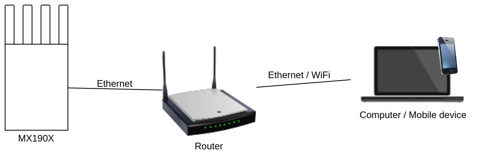
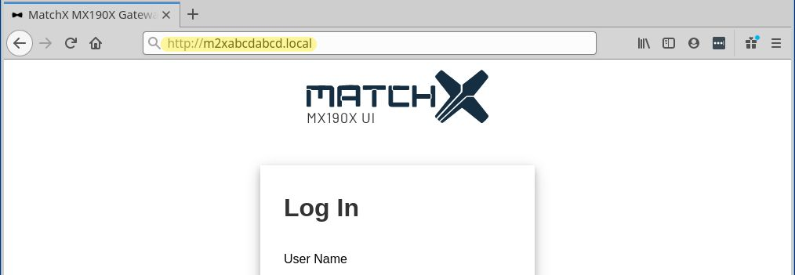
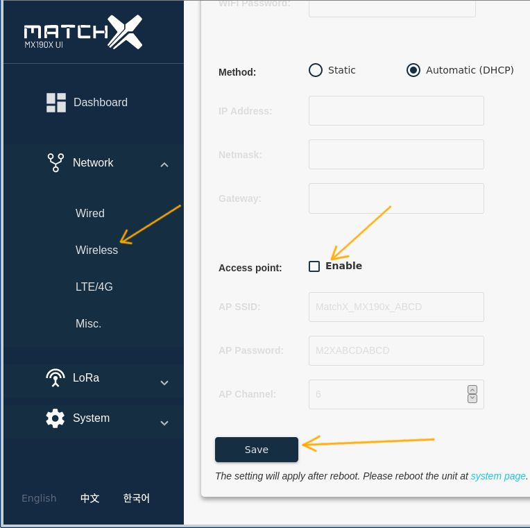
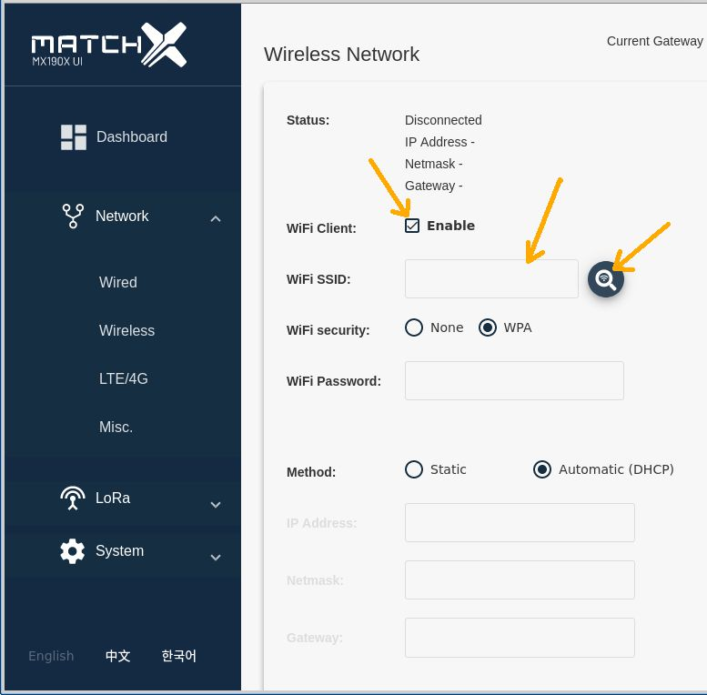
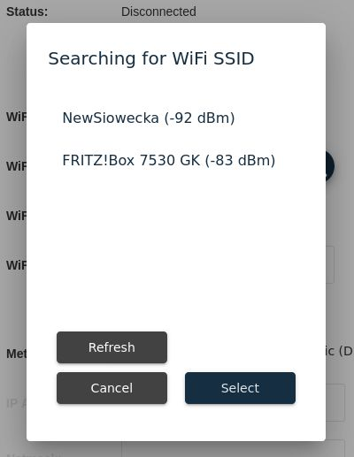
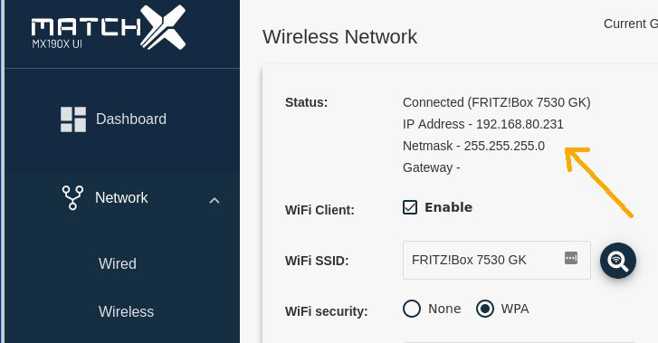
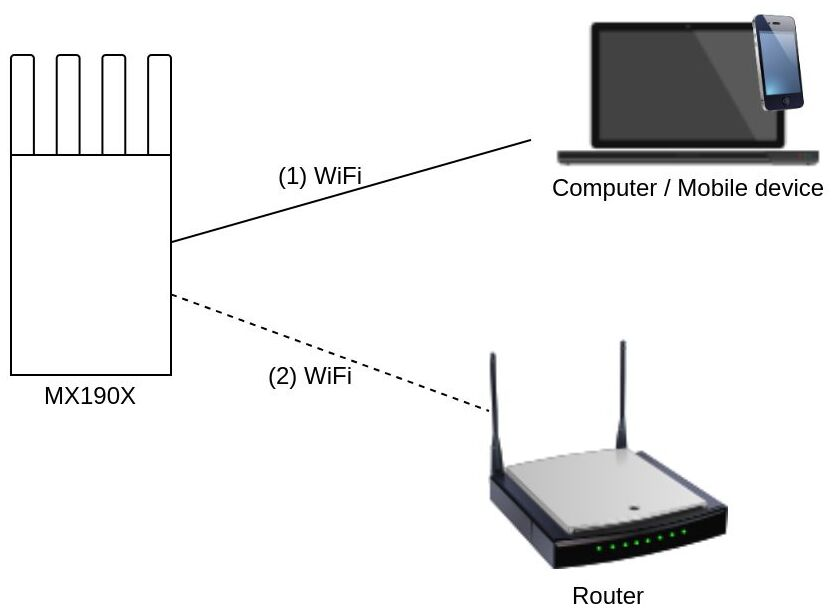
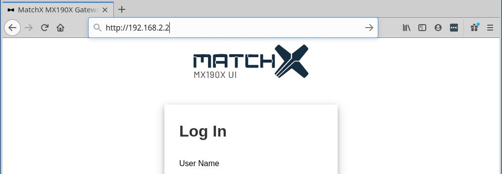
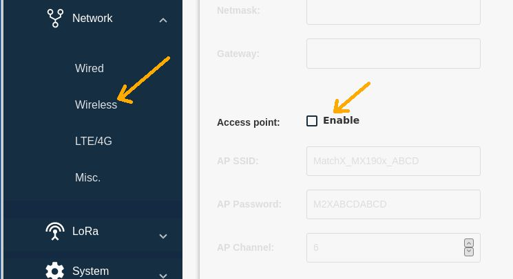

# Web GUI
## How to connect M2 Pro to internet
### Method 1
This method will use a wired connection to set up the M2 Pro.

You need a router with DHCP service to provide a local network connection and assign IP address to M2 Pro.

For advanced users that have a DHCP service on their computer, they can directly connect the computer with M2 Pro by using the Ethernet cable or via a network switch.

The M2 Pro has a web interface for access - you can use a web browser for the setup process. Follow the steps below to connect M2 Pro using WiFi connection:

Open a browser on your computer, use the serial number with a tailing “.local” as the URL to access the web interface. Ex: Serial number is M2XABCDABCD so the URL will be http://m2xabcdabcd.local

PS: To support this “.local” access, the computer needs to support the mDNS on its network function.

The Username is admin for the web interface.

The default Password is your M2 Pro serial number. On the above example, the password will be "M2XABCDABCD".

After login, go to "Network/Wireless" page.

By default, the Access Point is enabled. To make the M2 Pro work as a WiFi client (connect to WiFi router), you need to disable the "Access Point" by uncheck the Enable checkbox and click [Save] to save the configuration.

Go to the "System" page to reboot the M2 Pro.

After rebooting, login and go to "Network/Wireless" page.

Check the "WiFi Client" Enable checkbox to enable the WiFi client functionality.

Then, enter the SSID of your WiFi router, or click the [Search] button to search for SSID.
After selecting/entering an SSID, enter the WiFi password of the router.

Afterwards, click the [Save] button at the bottom of the page to save the configuration.

The new configuration will be applied after M2 Pro is rebooted.

Please keep the wired network connected and login again. If your WiFi configuration is correct, you can see it is connected and an IP address is assigned.
PS: The network gateway is blank here because the M2 Pro is still using the wired connection and its network gateway.

Now, the WiFi configuration is good and the M2 Pro is connected using WiFi connection. You can disconnect the wired/cable connection and wait a few minutes for the M2 Pro to switch its service to the WiFi connection.
PS: When switching from wired to wireless network, the LED may change to yellow or blinking yellow for a while.

### method 2
This method will use the Access Point function of the M2 Pro to set up the configuration and then switch to WiFi client.

By default settings, the M2 Pro Access Point function is turned on.

The SSID is “MatchX_MX190x_” tailing with the last 4 characters of the serial number. Ex: Serial number of MX190X is “M2XABCDABCD”, the the SSID will become “MatchX_MX190x_ABCD”.

The WiFi password is your M2 Pro serial number. On the above example, the password will be "M2XABCDABCD".

PS: If you found the password to the access point is changed and you forgot it, you can reset the M2 Pro back to default by following the steps in this link.

You can access the Web Interface at the IP address 192.168.2.2 after the computer connected to the M2 Pro.

The Username is admin for the web interface and the default Password is your M2 Pro serial number. On the above example, the password will be "M2XABCDABCD".

After login, go to "Network/Wireless" page. By default, the Access Point is enabled.

To make the M2 Pro work as a WiFi client (connect to WiFi router), you need to disable the Access Point so Uncheck the Enable checkbox.

Then, Check the "WiFi Client" Enable checkbox to enable the WiFi client functionality.

Enter the SSID and password of your WiFi router

PS: The SSID search will not work since the WiFi AP function is still active.

Lastly, click the [Save] button at the bottom of the page to save the configuration. The new configuration will be applied after M2 Pro is rebooted.

After rebooting, please check the LED for the status. If you are seeing a RED light, the WiFi connection is not working so you need to perform reset-to-default operation and re-do the setup procedure again.

Connect your computer back to your router and if your computer supports mDNS, you can access the Web Interface by “http://m2xabcdabcd.local” (for the example above). If your computer didn't supports mDNS, you need to access your router and check the IP address of the M2 Pro.
