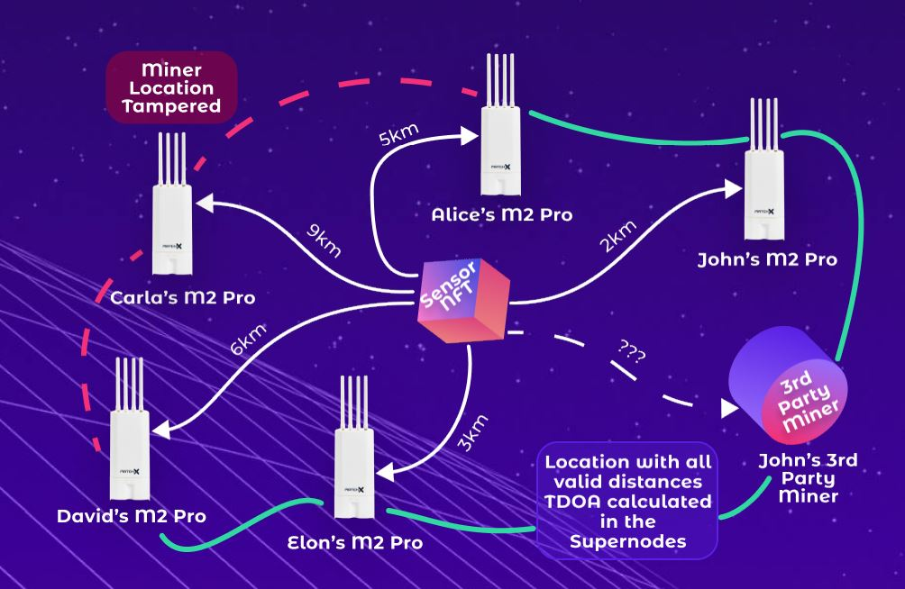

# Proof-of-Location
## Design Aims
A location is a rare resource that needs to be calculated by radio signals. 
Currently, there are three methods to calculate a location.
* First is a GPS signal, which only works outdoors, and can easily be tampered with as GPS radios can be emulated by software to fake a location. 
* Secondly, IP address calculations, this is a database technology that relies on the accuracy of the data input about a certain IP address, and often a VPN service can get a new IP for you to fake a location. 
* Thirdly, a Bluetooth-based location tracking, companies such as Apple are using it. it is hard or nearly impossible to fake the Bluetooth receiver that is held by the general public, as they pass by the Bluetooth tags and tell the network the exact location of the object in a decentralized approach.

MXProtocol designs the Proof of Location to solve the problem that Bluetooth often
fails to solve – distance. While Bluetooth only reaches 100-200 meters, MXC miners
can reach 1-40km to determine the location of the object in a decentralized way, as
the miners are held by different users.

Proof of Location is a localization algorithm that utilizes LPWAN uplink data with timestamps to triangulate the location of LPWAN sensors and M2 Pro miners. 
In order to triangulate the sensors, the algorithms first confirm the location of the miners with the downlinks they sent to the sensors. 
With regular downlink peer listenings, the algorithm is able to filter out the tampered miner locations as they can’t be heard by peer M2 Pro miners. 
Those miner locations are confirmed by the Proof of Location and then can respond to the uplink request for location services.

In the figure above, we can see how a sensor NFT’s Proof of Location works. 
* First of all, the sensor sends data that can be picked up by the miners as usual. Each data packet will be time stamped in the miner with precise time of arrival; this feature is executed by the hardware chip inside the M2 Pro miners. The third party miners won’t be able to provide this service due to the hardware limits. 
* Next, the MXC Controller needs to rule out the tampered locations of the miners or inaccurate ones with bias and peer Proof of Location data, if the miner is not physically located there or always changes locations, the Proof of Location can easily exclude this kind of data. Time difference of arrival (TDOA) based on location requires at least 3 miners with valid locations to calculate; the more miners present, the more accurate the location data will be.

All the miners that can provide Proof of Location will be able to validate more MXC results than the third party miners.

## Design and Implementation
It is expected that miners need to be equipped with Semtech SX1303 chips or others that have accurate timestamp functions in order to provide the location services.

The bias and credibility of the location data feed is also dependent on the Meta-XP and miner health factors of the miner, as the location data is mostly self-reporting and peer verified by the Proof of Location networks that are built by the community.

## MXC Controller
There are lists of services that LPWAN can provide to the sensors/end devices. 
For example, an over-the-air firmware update should be multi-casted to the sensors and calculate the position, which requires no computation for the resource-limited sensors.
Such a service requires resources of both a miner and the Supernode. 
Hence, MXC Controller will specify whether it is willing to pay for the service and its accuracy.
The more gateways that receive the packets, the more accurate the position will be.
In addition to this, data NFTs can also facilitate data transactions and would need a service to provision and provide the NFT to the blockchain. 
MXC Controller is designed to bridge the users and supernode/miners for NFT provisioning services.
Through the MXC Controller design, it is possible that the sensors/end devices pay 1 USD for lifetime free usage of the network, while choosing the available services to subscribe or pay. The outcome of the design will be as follows:
* Some sensors/end devices get the services and the resources that they demand through auction.
* Network deployments receive a compensation by offering services and resources to the LPWAN sensors/end devices.
* All the monetary transactions are done automatically in MXC/BTC/DOT without human intervention